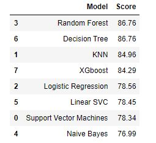

# Kaggle_Titanic_Analysis
## **Project: Titanic competition from Kaggle**  
The sinking of the Titanic is one of the most infamous shipwrecks in history.

On April 15, 1912, during her maiden voyage, the widely considered “unsinkable” RMS Titanic sank after colliding with an iceberg. Unfortunately, there weren’t enough lifeboats for everyone onboard, resulting in the death of 1502 out of 2224 passengers and crew.

While there was some element of luck involved in surviving, it seems some groups of people were more likely to survive than others.  

**The goal of the project is to build a predictive model that answers the question: “what sorts of people were more likely to survive?”**
## 2. Description of Data
The Yelp dataset is downloaded from Kaggle website.  
https://www.kaggle.com/c/titanic/data  

## 3. Summary of Progress
**Meet with data**
* Check null value.

**Analyze raw data by pivoting features and visualizing data**  
* Quickly analyze our feature correlations by pivoting features against each other
* Visualize correlations via seaborn.

**Cleaning**
* Correcting data by dropping features: Cabin and Ticket.
* Creating new feature extracting from existing features.
* Completing(filling na value) numerical continuous and categorical features.  
* Converting catergorical features into dummy columns for ML.
* Drop columns that are inrelevant.
* Create new feature combining existing features.

**Model, predict and solve by applying common use ML algorithm**
* Logistic Regression
* KNN or k-Nearest Neighbors
* Support Vector Machines
* Naive Bayes classifier
* XGboost
* Decision Tree
* Random Forest  
  

## 4. Workflow of data  
- Classifying. We may want to classify or categorize our samples. We may also want to understand the implications or correlation of different classes with our solution goal.

- Correlating. One can approach the problem based on available features within the training dataset. Which features within the dataset contribute significantly to our solution goal? Statistically speaking is there a correlation among a feature and solution goal? As the feature values change does the solution state change as well, and visa-versa? This can be tested both for numerical and categorical features in the given dataset. We may also want to determine correlation among features other than survival for subsequent goals and workflow stages. Correlating certain features may help in creating, completing, or correcting features.

- Converting. For modeling stage, one needs to prepare the data. Depending on the choice of model algorithm one may require all features to be converted to numerical equivalent values. So for instance converting text categorical values to numeric values.

- Completing. Data preparation may also require us to estimate any missing values within a feature. Model algorithms may work best when there are no missing values.

- Correcting. We may also analyze the given training dataset for errors or possibly innacurate values within features and try to corrent these values or exclude the samples containing the errors. One way to do this is to detect any outliers among our samples or features. We may also completely discard a feature if it is not contribting to the analysis or may significantly skew the results.

- Creating. Can we create new features based on an existing feature or a set of features, such that the new feature follows the correlation, conversion, completeness goals.

- Charting. How to select the right visualization plots and charts depending on nature of the data and the solution goals.

## 5. Conclusion
The Random Forest and Decision Tree models work best in the evaluation.  
 
